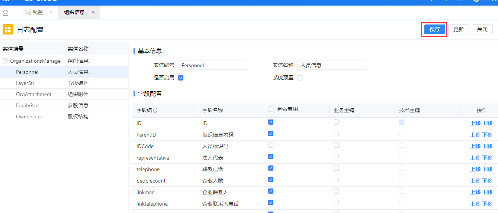

# <font>国企组织信息</font>

## 平台部分

### 如何提供报错日志？

\jstack\log下的logging.log文件。

PS:给开发人员提供日志时，请**<font color='#be002f'>重现几次</font>**错误操作，让错误信息多记录几次，以便开发人员查找错误信息。

PS:定期清理日志文件，不要让日志文件太大。超过20M时，打开日志文件会十分影响性能。

### 运维培训

如何获取补丁及安装补丁等等

http://edu.inspur.com/kng/course/package/document/d9e0fbdfc6d2457083f021aea0d7b4d0_76d6eb1f8d3e402b95f1955172bbd71a.html?taskId=null&st=null&objectId=null&uniqueid=1617777110244

已推出补丁下载工具，推荐使用补丁下载工具获取补丁！

补丁工具下载路径已迁移至

```java
\\10.110.80.110\产品服务器\内部自制工具安装盘\GS Cloud运维工具
```


Cloud产品基础知识

https://open.inspuronline.com/iGIX/#/document/mddoc/docs-gsp-cloud-ds%2Fdev-guide-beta%2Fdeploy-maintain%2Fdefault.md


补丁信息文件：\jstack\patchinfo\patchallmanagementlog.json


**过期的补丁不能安装**


**临时增量**是针对当前项目需求，制作的临时补丁文件，仅适用于当前时间当前项目使用！不具有普适性，不能过期部署和部署其他环境！


DBO部署工具：\tools\dbodeploy_java

Data文件导入工具：\tools\dataimport_java

Data文件导出工具(配置数据导出工具)：\\10.110.85.184\iGIX发布\依赖组件


## 组织信息部分

### 组织信息权限使用

<span id='AuthBase'>权限基础知识</span>：[https://open.inspuronline.com/iGIX/#/document/mddoc/docs-gsp-cloud-ds%2Fdev-guide-beta%2Fadvanced-development%2Foperating-framework%2Fauthorization-management%2F%E6%9D%83%E9%99%90%E6%A8%A1%E5%9E%8B.md](https://open.inspuronline.com/iGIX/#/document/mddoc/docs-gsp-cloud-ds%2Fdev-guide-beta%2Fadvanced-development%2Foperating-framework%2Fauthorization-management%2F权限模型.md)

数据权限怎么使用：https://open.inspuronline.com/iGIX/#/document/mddoc/docs-gsp-cloud-ds%2Fdev-guide-beta%2Fquickstart%2Fsysmanager-management-info%2F数据授权.md


下面详细介绍组织信息维护常用的分配数据权限方式。

<p><font color='#32cdff' size='3'>常用的分配方式，不是必须这样！</font><p>

<p><font color='#00ff74' size='3'>常用的分配方式，不是必须这样！！</font></p>

<p><font color='#fb7202' size='3'>常用的分配方式，不是必须这样！！！</font></p>

#### 组织岗分配数据权限

组织岗是以**岗位**为核心的数据隔离分配方式：不同的岗位分配不同的数据权限，同一岗位下的用户拥有相同的数据权限。

##### <span id = '1_1_1'>功能组分配组织信息权限</span>


##### <span>岗位分配功能组和数据权限</span>

<span id='1_1_2'>分配功能组</span>：


分配数据权限：


##### 用户分配岗位


##### 注意事项

组织岗分配数据权限，**国企组织行权限**不能设置维度。

<p><font color='#32cdff' size='3'>维度可删除，但是不能删除行权限！</font></p>

<p><font color='#00ff74' size='4'>维度可删除，但是不能删除行权限！！</font></p>

<p><font color='#fb7202' size='5'>维度可删除，但是不能删除行权限！！！</font></p>


#### 通用岗分配数据权限

通用岗一般是以**用户**为核心的数据分配方式，同一岗位下不同用户可拥有不同的数据权限。

##### 国企组织行权限启用维度


##### 功能组分配组织信息权限

分配方式见1.1.1节**[组织岗分配数据权限](#1_1_1)**。


##### 岗位分配功能组和数据权限

分配功能组方式见1.1.2节**[分配功能组](#1_1_2)**。

分配数据权限：


##### 用户分配岗位和数据权限

用户分配岗位：


用户分配数据权限：


#### <font color = 'red'>权限自动继承方式分配数据权限</font>

问：新加了一条数据，保存后刷新页面数据不见了，为什么？

答：没有给数据分配权限

问：有没有一种方式能让用户自动继承新添加的数据权限？

答：针对子级数据时可以，但是使用有限制，会有权限扩大的隐患。

使用方法：组织岗 + 维度 + 权限规则


<p><font color='#32cdff' size='3'>当前授权方式会造成权限扩大，即当前岗位下的所有用户都会拥有新加数据权限！</font></p>

<p><font color='#00ff74' size='4'>当前授权方式会造成权限扩大，即当前岗位下的所有用户都会拥有新加数据权限！！</font></p>

<p><font color='#fb7202' size='4.5'>当前授权方式会造成权限扩大，即当前岗位下的所有用户都会拥有新加数据权限！！！</font></p>


##### 国企组织行权限启用维度

【定制平台】——【业务定制平台】——【权限定义】——【权限字段】


##### 国企组织全局权限启用权限规则

【定制平台】——【业务定制平台】——【权限定义】——【权限字段】


##### 组织岗授权

###### 组织岗中授权业务组织


###### 组织岗授权数据权限


##### 用户授权岗位


<p><font color='#32cdff' size='3'>当前授权方式可以使用但不推荐！请慎重考虑风险问题！</font></p>

<p><font color='#00ff74' size='4'>当前授权方式可以使用但不推荐！请慎重考虑风险问题！！</font></p>

<p><font color='#fb7202' size='4.5'>当前授权方式可以使用但不推荐！请慎重考虑风险问题！！！</font></p>


#### 其他方式

分配权限的方式有很多，各种方式可交错使用，此处不做额外介绍，请配合**[权限基础知识](#AuthBase)**使用。

### 组织信息维护打开为什么没有数据？

#### 检查组织信息表

检查**组织信息表**（<font color='red'> SASAOrganizations</font>）,执行以下SQL来查询:

```sql
SELECT ID,Code AS 单位编号,Name_chs AS 单位名称,Path_ParentElement AS 父节点,Path_Layer AS 级数,Path_IsDetail AS 明细,Path_Sequence AS 顺序号,PathCode_Path AS 分级码,PathCode_layer AS 分级码级数
from sasaorganizations 
Order by 分级码;
```

正常情况下，分级码一列应该<font color='red'>全部有值</font>且是<font color='red'>规律</font>的。如出现分级码为NULL的情况，需要在【分级信息维护】中执行【初始化分级码】。

#### 检查组织信息的数据权限

**<font color='#32cdff' size='3'>新增的数据不会继承权限！</font>**

**<font color='#00ff74' size='4'>新增的数据不会继承权限！！</font>**

**<font color='#fb7202' size='5'>新增的数据不会继承权限！！！</font>**

数据权限必须经过分配权限的过程。

### 导入导出

【定制平台】——【业务定制平台】——【数据导入导出】——【导入导出规则】

在以上菜单中配置导入导出模板。


#### 数据导入

下面模板后，请仔细阅读首页【<font color='red'>填写指南</font>】，里面针对模板中导入的每一个字段做了详细解释。


导入需要注意**分级码信息**的填写，**<font color='red'>多数报错</font>**都是由此处引起的，分级码介绍请阅读[什么是分级码](#path)


导入报错时，请查看后台报错日志，通常报错情况如下：


查找对应sheet页即可排查问题。

#### 数据导出

有特定的需求或者对导出的Excel文件有特殊要求，在【导入导出规则】无法配置时，需要联系二开老师处理或者将需求反馈至开发处理。

### 什么是分级码

<span id='path'>树的分级通常有两种情况</span>，即**分级码**分级和**父节点**分级。

#### 分级码分级

分级码分级由分级码(path)、级数(layer)和是否明细(isDetail)组成。分级码4位一级，36进制；级数即该数据是第几级；是否明细表示该数据是否有子级，有子级非明细，无子级明细。示例如下：


#### 父节点分级

父节点分级由父节点(parentElement)、级数(layer)、是否明细(isDetail)、顺序号(sequence)组成。父节点存储该数据的上级ID。示例入下：


### 删除报错

#### 数据引用检查时发生异常

<span id='remove'>通常会有如下报错方式：</span>


排查思路：多执行几次删除，让报错信息多记录几次，打开日志文件，搜索 **对应的程序集和元数据** ，通常会有如下信息：


即可得知报错缘由，联系对应组开发即可。

注： 已上述报错举例：<font color='red'>ConfigID</font>“com.inspur.gs.sas.parl.parlmatter.ParlMatter”

sas：应用编号，parl:模块编号，parlmatter：应用分组，ParlMatter：具体应用

可在【定制平台】——【开发定制、——【菜单定义】——【应用】中查找详细信息。

com.inspur.gs.sasa.jgzz...监督追责，联系

com.inspur.gs.sasa.tiob...三重一大，联系刘文鹏老师

com.inspur.gs.sasa.soeo...国企组织信息，联系柳庆涛

com.inspur.gs.sasa.sers...国企改革督办,联系

com.inspur.gs.sas...事业部开发，一般联系事业部项目经理即可


附：常用处理方式：

select * from gsprefconfiginfo where upper(referrer) like upper('%<font color='red'>ConfigID</font>%')，查询出引发异常数据，删除或者补全。

### 运行时定制

【<span id='RunTime'>定制平台</span>】——【业务定制平台】——【业务配置】——【业务配置中心】


运行时定制操作手册请向平台提供，产品部不做额外培训。

常见问题：

#### 预览后页面空白

浏览器F12看报错，

服务台看报错：

若报错如上述截图描述，查看\metadata\platform\common\metadata文件夹下元数据文件Inspur.GS.Gsp.Web.WebCmp.mdpkg，使用压缩软件打开，


在TreeCardController.webcmd中无法找到**loadFullTree**时，请联系平台部或者开发获取最新命令构件。

### 操作权限

在菜单【系统公共】 —— 【系统管理】—— 【权限管理】—— 【功能组】中维护组织信息操作权限。目前仅支持增删改操作权限，对应组织信息维护中【新增同级】【新增子级】【编辑】【保存】按钮操作权限。


### 变更日志

【<span id='RunTime'>定制平台</span>】——【业务定制平台】——【业务变更日志】——【日志配置】中配置日志变更记录范围。




注意：变更日志是需要配置Yaml文件的，使用变更日志前请核实是否已经正确配置。

```yaml
#如果使用变更日志，请修改文件：\jstack\runtime\application.yaml
#配置节位置：
event-configurations:
  eventManagers:
  - name: BefSaveEventManager
    listeners:
#增加以下配置（注意yaml文件缩进！）：
	- name: Chgdr
      implClassName: com.inspur.edp.chgdr.adapter.bef.ChgdrBefSaveEventListener
```


## 二开部分

### 接口二开

组织信息目前已支持二开的接口有：生成编号、生成标识码、保存校验、引入系统组织，查询SASAServiceRule表查看详细。

#### 二开方式

待补充


### 功能二开

#### 运行时定制

##### 准备工作

参考https://open.inspuronline.com/iGIX/#/document/mddoc/docs-gsp-cloud-ds%2Fdev-guide-beta%2Fadvanced-development%2Frtc-template%2Ffunc-desc%2Fprepare.md


##### 操作手册

[运行时定制](#RunTime)


#### IGIX二开

需要联系耿伟老师指导配置Maven库引用关系，正式库为**maven-ba-release**。

**两点建议**：最小化引入，只引入需要的，忌大而全的全部引入所有字段；建立公共的元数据，能使用公共的元数据就使用公共的，不要盲目建立。

无需删除引用检查的，不要选用引用检查功能，否则容易造成[数据引用检查时发生异常](#remove)。