# <font>国企组织信息</font>

## 一、平台部分

### 1、如何提供报错日志？

\jstack\log下的logging.log文件。

PS:给开发人员提供日志时，请**<font color='#be002f'>重现几次</font>**错误操作，让错误信息多记录几次，以便开发人员查找错误信息。

PS:定期清理日志文件，不要让日志文件太大。超过20M时，打开日志文件会十分影响性能。

### 2、运维培训

如何获取补丁及安装补丁等等

http://edu.inspur.com/o2o/signup/signupcenterdetail.htm?tid=ba9a3438-cf34-49d1-b5f2-0c9890e68ce2&id=


Cloud产品基础知识

https://open.inspuronline.com/iGIX/#/document/mddoc/docs-gsp-cloud-ds%2Fdev-guide-beta%2Fdeploy-maintain%2Fdefault.md


补丁信息文件：\jstack\patchinfo\patchallmanagementlog.json


**过期的补丁不能安装**


DBO部署工具：\tools\dbodeploy_java

Data文件导入工具：\tools\dataimport_java

Data文件导出工具(配置数据导出工具)：\\10.110.85.184\iGIX发布\依赖组件

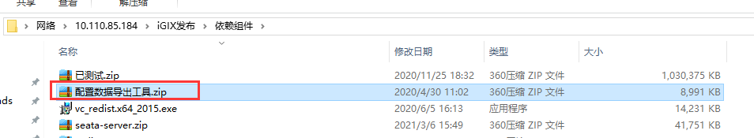


## 二、组织信息部分

### 1、组织信息权限使用

<span id='AuthBase'>权限基础知识</span>：[https://open.inspuronline.com/iGIX/#/document/mddoc/docs-gsp-cloud-ds%2Fdev-guide-beta%2Fadvanced-development%2Foperating-framework%2Fauthorization-management%2F%E6%9D%83%E9%99%90%E6%A8%A1%E5%9E%8B.md](https://open.inspuronline.com/iGIX/#/document/mddoc/docs-gsp-cloud-ds%2Fdev-guide-beta%2Fadvanced-development%2Foperating-framework%2Fauthorization-management%2F权限模型.md)

数据权限怎么使用：https://open.inspuronline.com/iGIX/#/document/mddoc/docs-gsp-cloud-ds%2Fdev-guide-beta%2Fquickstart%2Fsysmanager-management-info%2F数据授权.md


下面详细介绍组织信息维护常用的分配数据权限方式。

<font color='#32cdff' size='3'>常用的分配方式，不是必须这样！</font>

<font color='#00ff74' size='3'>常用的分配方式，不是必须这样！！</font>

<font color='#fb7202' size='3'>常用的分配方式，不是必须这样！！！</font>

#### 1.1组织岗分配数据权限

组织岗是以**岗位**为核心的数据隔离分配方式：不同的岗位分配不同的数据权限，同一岗位下的用户拥有相同的数据权限。

##### 1.1.1 <span id = '1_1_1'>功能组分配组织信息权限</span>

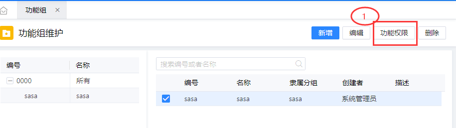

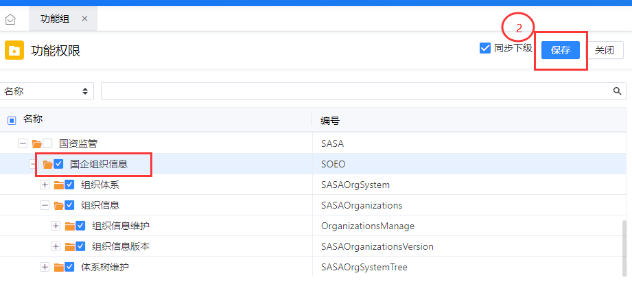

##### 1.1.2 <span>岗位分配功能组和数据权限</span>

<span id='1_1_2'>分配功能组</span>：


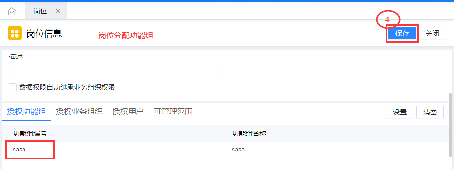


分配数据权限：


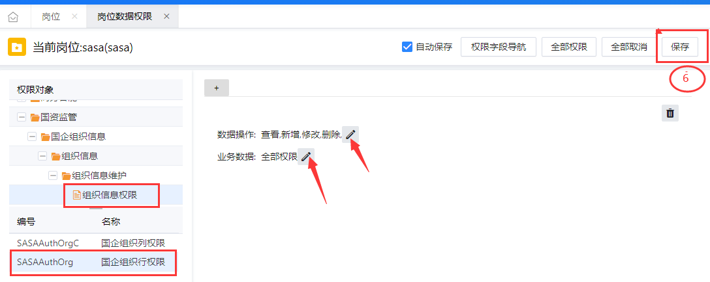

##### 1.1.3 用户分配岗位

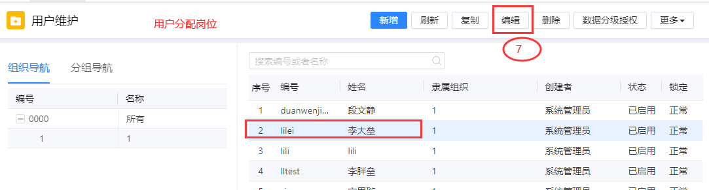

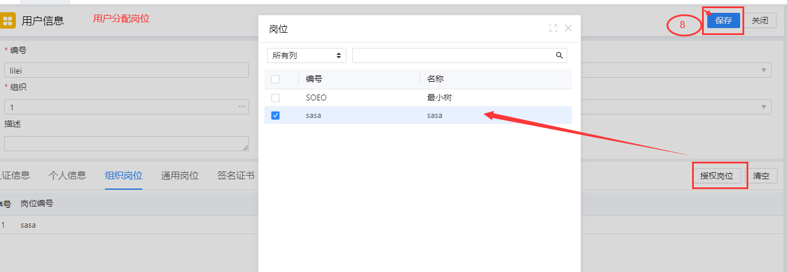

##### 1.1.4  注意事项

组织岗分配数据权限，**国企组织行权限**不能设置维度。

<font color='#32cdff' size='3'>维度可删除，但是不能删除行权限！</font>

<font color='#00ff74' size='4'>维度可删除，但是不能删除行权限！！</font>

<font color='#fb7202' size='5'>维度可删除，但是不能删除行权限！！！</font>

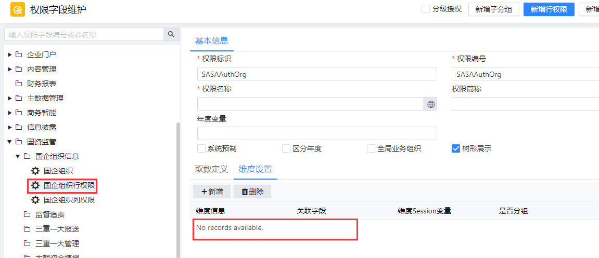

#### 1.2  通用岗分配数据权限

通用岗一般是以**用户**为核心的数据分配方式，同一岗位下不同用户可拥有不同的数据权限。

##### 1.2.1 国企组织行权限启用维度

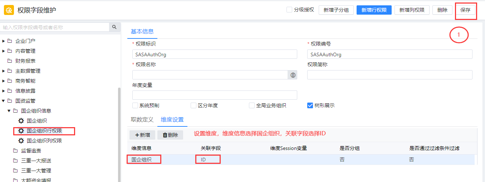

##### 1.2.2 功能组分配组织信息权限

分配方式见1.1.1节**[组织岗分配数据权限](#1_1_1)**。


##### 1.2.3 岗位分配功能组和数据权限

分配功能组方式见1.1.2节**[分配功能组](#1_1_2)**。

分配数据权限：

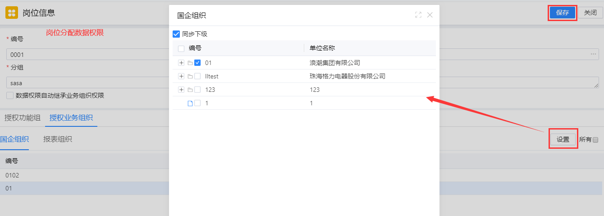

##### 1.2.4 用户分配岗位和数据权限

用户分配岗位：

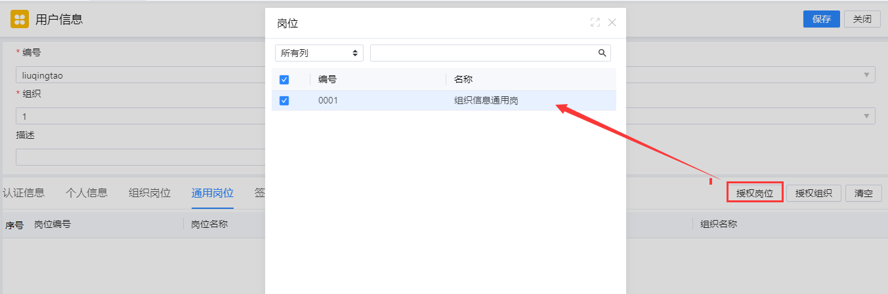

用户分配数据权限：

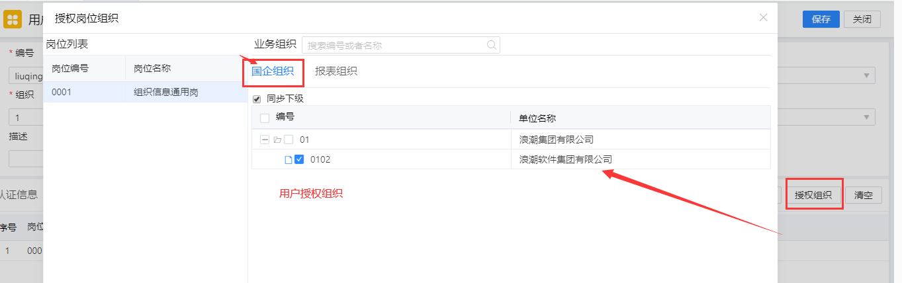

#### 1.3 其他方式

分配权限的方式有很多，各种方式可交错使用，此处不做额外介绍，请配合**[权限基础知识](#AuthBase)**使用。

### 2、组织信息维护打开为什么没有数据？

#### 2.1、检查组织信息表

检查**组织信息表**（<font color='red'> SASAOrganizations</font>）,执行以下SQL来查询:

```sql
SELECT ID,Code AS 单位编号,Name_chs AS 单位名称,Path_ParentElement AS 父节点,Path_Layer AS 级数,Path_IsDetail AS 明细,Path_Sequence AS 顺序号,PathCode_Path AS 分级码,PathCode_layer AS 分级码级数
from sasaorganizations 
Order by 分级码;
```

正常情况下，分级码一列应该<font color='red'>全部有值</font>且是<font color='red'>规律</font>的。如出现分级码为NULL的情况，需要在【分级信息维护】中执行【初始化分级码】。

#### 2.2、检查组织信息的数据权限

**<font color='#32cdff' size='3'>新增的数据不会继承权限！</font>**

**<font color='#00ff74' size='4'>新增的数据不会继承权限！！</font>**

**<font color='#fb7202' size='5'>新增的数据不会继承权限！！！</font>**

数据权限必须经过分配权限的过程。

### 3、导入导出

【定制平台】——【业务定制平台】——【数据导入导出】——【导入导出规则】

在以上菜单中配置导入导出模板。


#### 3.1数据导入

下面模板后，请仔细阅读首页【<font color='red'>填写指南</font>】，里面针对模板中导入的每一个字段做了详细解释。


导入需要注意**分级码信息**的填写，**<font color='red'>多数报错</font>**都是由此处引起的，分级码介绍请阅读[什么是分级码](#_link_path_introduce)


导入报错时，请查看后台报错日志，通常报错情况如下：

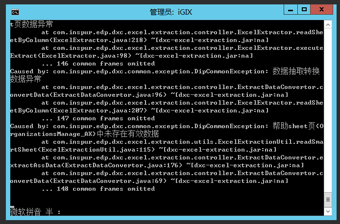

查找对应sheet页即可排查问题。

#### 3.2数据导出

有特定的需求或者对导出的Excel文件有特殊要求，在【导入导出规则】无法配置时，需要联系二开老师处理或者将需求反馈至开发处理。

### 4、<span id='_link_path_introduce'>什么是分级码</span>

树的分级通常有两种情况，即**分级码**分级和**父节点**分级。

#### 4.1 分级码分级

分级码分级由分级码(path)、级数(layer)和是否明细(isDetail)组成。分级码4位一级，36进制；级数即该数据是第几级；是否明细表示该数据是否有子级，有子级非明细，无子级明细。示例如下：

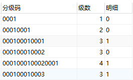

#### 4.2 父节点分级

父节点分级由父节点(parentElement)、级数(layer)、是否明细(idDetail)、顺序号(sequence)组成。父节点存储该数据的上级ID。示例入下：

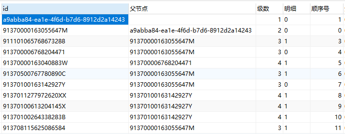

### 5、删除报错

#### 5.1 数据引用检查时发生异常

通常会有如下报错方式：

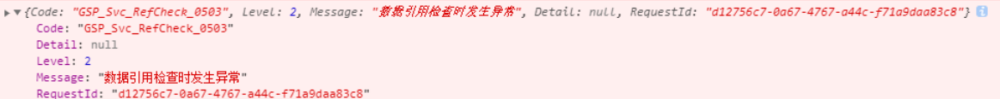

排查思路：多执行几次删除，让报错信息多记录几次，打开日志文件，搜索 **对应的程序集和元数据** ，通常会有如下信息：

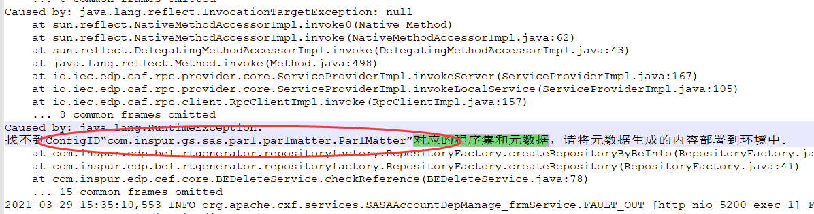

即可得知报错缘由，联系对应组开发即可。

注： 已上述报错举例：<font color='red'>ConfigID</font>“com.inspur.gs.sas.parl.parlmatter.ParlMatter”

sas：应用编号，parl:模块编号，parlmatter：应用分组，ParlMatter：具体应用

可在【定制平台】——【开发定制、——【菜单定义】——【应用】中查找详细信息。

com.inspur.gs.sasa.jgzz...监督追责，联系

com.inspur.gs.sasa.tiob...三重一大，联系刘文鹏老师

com.inspur.gs.sasa.soeo...国企组织信息，联系柳庆涛

com.inspur.gs.sasa.sers...国企改革督办,联系

com.inspur.gs.sas...事业部开发，一般联系事业部项目经理即可


附：常用处理方式：

select * from gsprefconfiginfo where upper(referrer) like upper('%<font color='red'>ConfigID</font>%')，查询出引发异常数据，删除或者补全。

### 6、运行时定制


